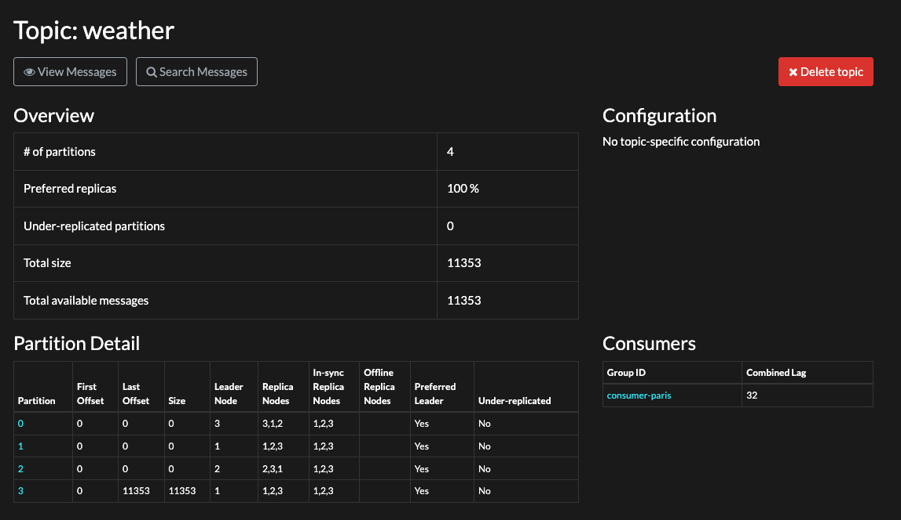

# Illustration 

```lua
Producteur         Leader          Follower 1       Follower 2
    |                |                 |                |
    |---Produce----->|                 |                |     (1) Envoi du message au leader
    |                |---Replicate---->|                |     (2) Réplication vers Follower 1
    |                |---Replicate--------------------->|     (3) Réplication vers Follower 2
    |                |<--Ack-----------|                |     (4) Ack de Follower 1 au Leader
    |                |<------------------------------Ack|     (5) Ack de Follower 2 au Leader
    |                |                                  |
    |<---Ack(all)----|                 |                |     (6) Ack global du leader au Producteur (acks=all)
```

Le Producteur envoie un message à la partition (sur le broker Leader).

Le Leader écrit dans le segment courant puis réplique le message aux Followers ISR (In-Sync Replicas).

Les Followers accusent réception (ack) après écriture locale du message en fonction de la politique d'acquittement. 

Envoie d'un ack en fonction de la politique d'acquittement (ISR). Dans notre cas (acks=all) quand tous les ISR ont bien persisté le message, le Leader envoie un ack au Producteur.

## Mise en oeuvre : 

On peut illuster cela en démarrant le docker-compose.yml du projet après avoir choisi son procducteur. Le producer-key-equals.py semble plus adapté => aller le choisir dans le fichier Dockerfile. 

Ensuite on ouvre un shell sur un des producteurs et on lance : 

```bash
docker exec kafka-1 kafka-console-consumer.sh --bootstrap-server kafka-1:9092 --topic weather --from-beginning --property print.offset=true
```
Mais cela va trop vite. 

On peut voir la description du topic weather : 

```bash
docker exec kafka-1 kafka-topics.sh --bootstrap-server kafka-1:9092 --describe --topic weather
```

Pour savoir où se trouve l'état de consommation d'un topic il faut connaitre le "consumer-group". Pour cela il n'y a pas de commande directe. On peut avoir la liste des consumer-groups : 

```bash
docker exec kafka-1 kafka-consumer-groups.sh --bootstrap-server kafka-1:9092 --list
```

Par exemple cela peut faire un retour tel que : 

```
console-consumer-72099
console-consumer-67971
console-consumer-91437
consumer-paris
```

Ensuite on examine les consumer-group individuellement jusqu'à trouver celui que l'on cherche : 

```bash
docker exec kafka-1 kafka-consumer-groups.sh --bootstrap-server kafka-1:9092 --describe --group consumer-paris
```

qui produit par exemple : 

```
GROUP           TOPIC           PARTITION  CURRENT-OFFSET  LOG-END-OFFSET  LAG             CONSUMER-ID                                              HOST            CLIENT-ID
consumer-paris  weather         1          0               0               0               kafka-python-2.2.11-3216b4e8-f5dd-4812-b676-8543e3bceb41 /172.18.0.3     kafka-python-2.2.11
consumer-paris  weather         0          0               0               0               kafka-python-2.2.11-3216b4e8-f5dd-4812-b676-8543e3bceb41 /172.18.0.3     kafka-python-2.2.11
consumer-paris  weather         3          15187           15194           7               kafka-python-2.2.11-3216b4e8-f5dd-4812-b676-8543e3bceb41 /172.18.0.3     kafka-python-2.2.11
consumer-paris  weather         2          0               0               0               kafka-python-2.2.11-3216b4e8-f5dd-4812-b676-8543e3bceb41 /172.18.0.3     kafka-python-2.2.11
```

Cela nous permet d'identifier que le consumer-paris est bien associé au topic weather. Son état de lecture est dans notre cas offset=15187. L'offset du topic est en avance : 15194. Du coup il y a un lag de 7 entre la production et la consommation. 

Une autre façon plus directe de trouver directement ces renseignements si on a un kafdrop fonctionnel sur notre cluster kafka : l'URL http://localhost:9000/topic/weather nous décrit le topic.



Le combinedLag fait la synthèse par GroupID des retards de consommation.